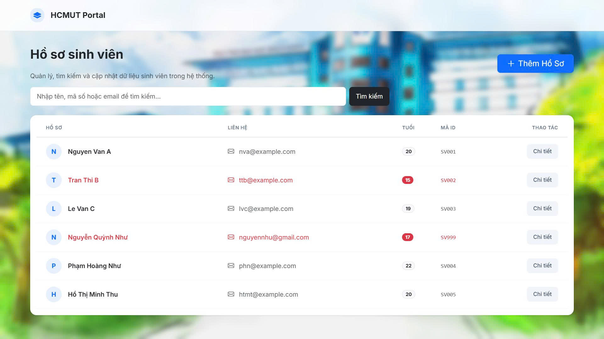
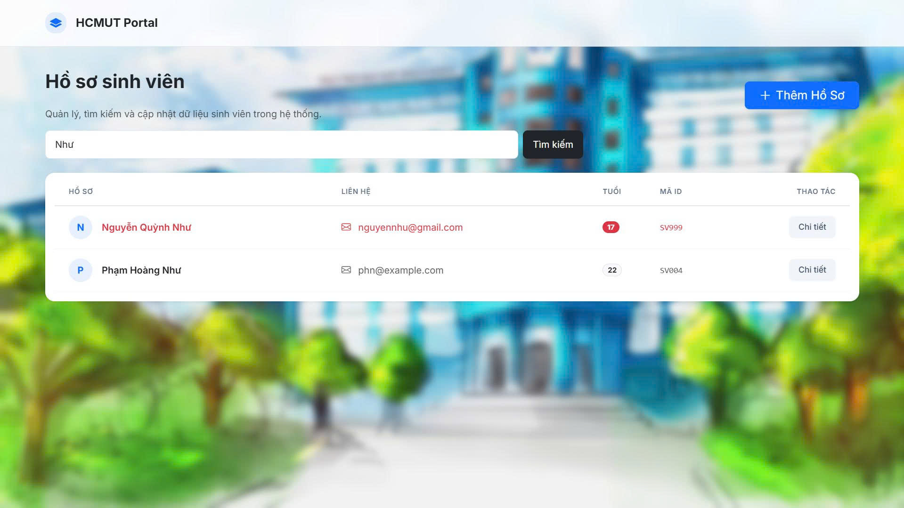
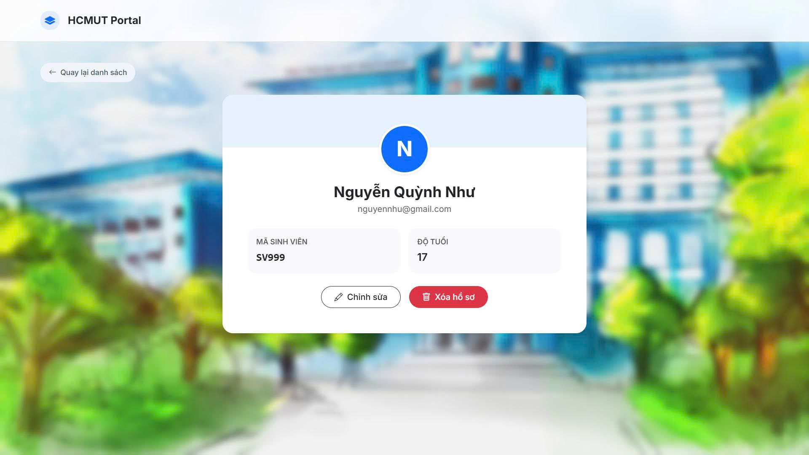
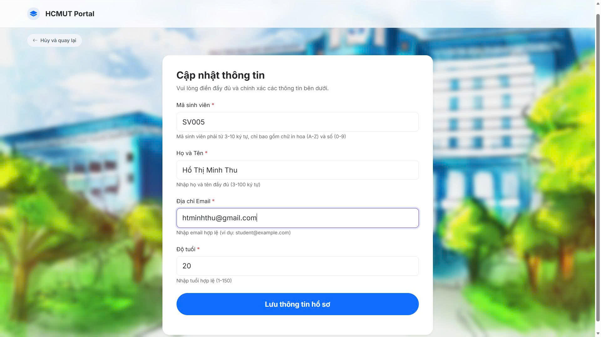
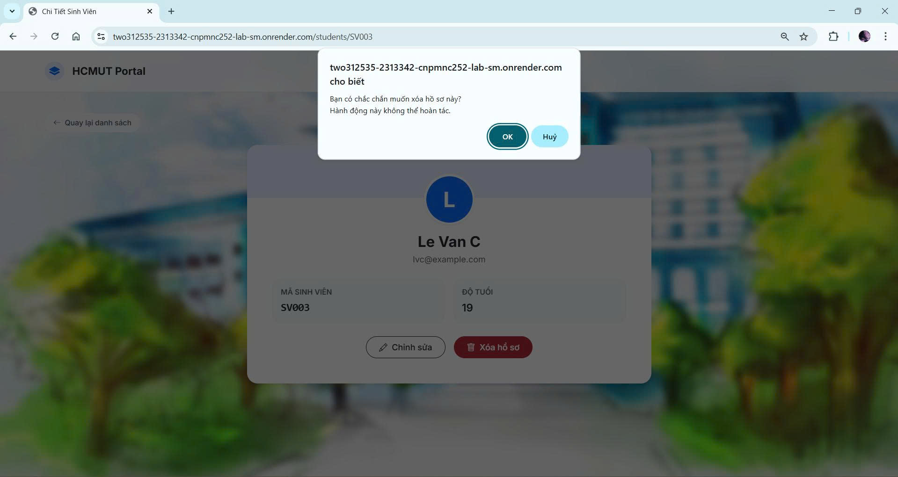

# Student Management System

Web application quản lý sinh viên sử dụng Spring Boot, Thymeleaf, và PostgreSQL.

---

## Thông tin nhóm

- **Trường:** Đại học Bách Khoa TP.HCM
- **Khoa:** Khoa học và Kỹ thuật Máy tính
- **Môn học:** Công nghệ Phần mềm Nâng cao
- **Học kỳ:** 2 / Năm học 2025-2026
- **Lab:** Student Management system - Final Product Deployment

### Thành viên

| MSSV | Họ và Tên | GitHub |
|------|-----------|--------|
| 2312535 | Nguyễn Quỳnh Như | [@nhunguyen133](https://github.com/nhunguyen133) |
| 2313342 | Hồ Thị Minh Thu | [@Thu-sunrise](https://github.com/Thu-sunrise) |

---

## Deployment (Production)

### **Live Demo**

**Public URL:** [https://two312535-2313342-cnpmnc252-lab-sm.onrender.com/students](https://two312535-2313342-cnpmnc252-lab-sm.onrender.com/students)


### **Technology Stack**

- **Hosting:** Render.com (Free tier)
- **Database:** Neon.tech PostgreSQL (Free tier)
- **Container:** Docker
- **CI/CD:** Auto-deploy from GitHub `main` branch

## Cấu trúc Project

```
student-management/
├── src/
│   ├── main/
│   │   ├── java/vn/edu/hcmut/cse/adsoftweng/lab/
│   │   │   ├── config/
│   │   │   │   ├── DataInitializer.java
│   │   │   │   └── DotenvConfig.java
│   │   │   ├── controller/
│   │   │   │   ├── StudentController.java
│   │   │   │   └── StudentWebController.java
│   │   │   ├── entity/
│   │   │   │   └── Student.java
│   │   │   ├── repository/
│   │   │   │   └── StudentRepository.java
│   │   │   ├── service/
│   │   │   │   └── StudentService.java
│   │   │   └── StudentManagementApplication.java
│   │   └── resources/
│   │       ├── templates/
│   │       │   ├── fragments/
│   │       │   │   └── layout.html            # Reusable layout
│   │       │   └── students/
│   │       │       ├── list.html              # List view with search
│   │       │       ├── detail.html            # Detail view
│   │       │       └── form.html              # Add/Edit form
│   │       └── application.properties
│   └── test/
├── .env.example
├── .gitignore
├── .dockerignore
├── Dockerfile
├── pom.xml
└── README.md
```

---

## Chức năng

### Web UI (`/students`)

| Chức năng | Mô tả | Screenshot |
|-----------|-------|------------|
| **Danh sách** | Hiển thị tất cả sinh viên, highlight sinh viên <18 tuổi |  |
| **Tìm kiếm** | Tìm kiếm theo tên (case-insensitive) |  |
| **Chi tiết** | Xem đầy đủ thông tin sinh viên |  |
| **Thêm mới** | Form thêm sinh viên với validation |  |
| **Chỉnh sửa** | Cập nhật thông tin sinh viên |  |
| **Xóa** | Xóa sinh viên với modal xác nhận |  |

### REST API (`/api/students`)

| Method | Endpoint | Description | Request Body | Response |
|--------|----------|-------------|--------------|----------|
| `GET` | `/api/students` | Lấy danh sách tất cả sinh viên | - | `200 OK` + JSON array |
| `GET` | `/api/students/{id}` | Lấy thông tin sinh viên theo ID | - | `200 OK` + JSON object<br>`404 Not Found` nếu không tồn tại |
| `GET` | `/api/students/search?keyword=` | Tìm kiếm sinh viên theo tên | - | `200 OK` + JSON array |
| `POST` | `/api/students` | Tạo sinh viên mới | JSON object | `201 Created` + JSON object<br>`409 Conflict` nếu ID đã tồn tại |
| `PUT` | `/api/students/{id}` | Cập nhật thông tin sinh viên | JSON object | `200 OK` + JSON object<br>`404 Not Found` nếu không tồn tại |
| `DELETE` | `/api/students/{id}` | Xóa sinh viên theo ID | - | `204 No Content`<br>`404 Not Found` nếu không tồn tại |

**Example Request - POST `/api/students`:**
```json
{
  "id": "SV001",
  "name": "Nguyen Van A",
  "email": "nva@example.com",
  "age": 20
}
```

**Example Response - GET `/api/students`:**
```json
[
  {
    "id": "SV001",
    "name": "Nguyen Van A",
    "email": "nva@example.com",
    "age": 20
  }
]
```

---

## Yêu cầu hệ thống (Local Development)

- Java 17 hoặc cao hơn
- PostgreSQL 12+ hoặc Docker
- Maven 3.6+
- Git

---

## Cài đặt và Chạy (Local)

### 1️. Clone repository

```bash
git clone https://github.com/nhunguyen133/2312535-2313342-cnpmnc252-lab-sm.git
cd 2312535-2313342-cnpmnc252-lab-sm
```

### 2️. Cấu hình Database

**Option A: Sử dụng PostgreSQL local**

```sql
-- Tạo database
CREATE DATABASE student_management;
```

Tạo file `.env`:
```bash
cp .env.example .env
```

Chỉnh sửa `.env`:
```properties
POSTGRES_HOST=localhost
POSTGRES_PORT=5432
POSTGRES_DB=student_management
POSTGRES_USER=postgres
POSTGRES_PASSWORD=your_password
```

**Option B: Sử dụng Docker**

```bash
docker run -d \
  --name student-postgres \
  -e POSTGRES_DB=student_management \
  -e POSTGRES_USER=postgres \
  -e POSTGRES_PASSWORD=postgres \
  -p 5432:5432 \
  postgres:15-alpine
```

### 3️. Build và chạy ứng dụng

```bash
# Build project
./mvnw clean install

# Chạy ứng dụng
./mvnw spring-boot:run
```

### 4️. Truy cập ứng dụng

- **Web UI:** http://localhost:8080/students
- **REST API:** http://localhost:8080/api/students

---

## Docker

### Build & Run locally

```bash
# Build image
docker build -t student-management .

# Run container
docker run -p 8080:8080 \
  -e DATABASE_URL="jdbc:postgresql://host.docker.internal:5432/student_management" \
  -e DB_USERNAME="postgres" \
  -e DB_PASSWORD="postgres" \
  student-management
```

### Docker Compose (Local Development)

```bash
# Start all services
docker-compose up -d

# Stop all services
docker-compose down

# View logs
docker-compose logs -f
```

---

## Trả lời câu hỏi lý thuyết (Lab 1)

- **Tại sao Database lại chặn thao tác Insert một sinh viên có id trùng với một người đã có sẵn?**

Cơ sở dữ liệu chặn thao tác này vì trường `id` được thiết lập làm Ràng buộc Khóa Chính (Primary Key). Khóa chính có chức năng định danh duy nhất cho mỗi bản ghi trong bảng. Do đó, hệ thống sẽ báo lỗi `UNIQUE constraint failed` để đảm bảo tính toàn vẹn và không cho phép trùng lặp dữ liệu.

- **Khi Insert một sinh viên nhưng bỏ trống cột name (để NULL), Database có báo lỗi không? Sự thiếu chặt chẽ này ảnh hưởng gì khi code Java đọc dữ liệu lên?**

Dựa vào câu lệnh tạo bảng, cột `name` (`name TEXT`) chưa được thiết lập ràng buộc `NOT NULL`. Do đó, cơ sở dữ liệu sẽ không báo lỗi khi lưu giá trị rỗng. Tuy nhiên, khi mã nguồn Java đọc dữ liệu lên, đối tượng sinh viên sẽ chứa giá trị `null` ở trường tên. Nếu ứng dụng cố gắng gọi các phương thức xử lý chuỗi trên thuộc tính này mà không kiểm tra trước, chương trình sẽ gặp lỗi `NullPointerException`.

- **Tại sao mỗi lần tắt ứng dụng và chạy lại, dữ liệu cũ trong Database lại bị mất hết?**

Nguyên nhân nằm ở cấu hình `spring.jpa.hibernate.ddl-auto=create` trong file `application.properties`. Thuộc tính `create` chỉ thị cho Hibernate tự động xóa toàn bộ dữ liệu và cấu trúc bảng cũ để tạo lại bảng mới hoàn toàn mỗi khi ứng dụng khởi động. Trong môi trường thực tế (production), cấu hình này sẽ được đổi thành `update` hoặc `none` để bảo vệ dữ liệu.

---

## Screenshots

### 1. Trang Danh Sách

*Hiển thị danh sách với tìm kiếm và highlight sinh viên <18 tuổi*

### 2. Trang Chi Tiết

*Thông tin đầy đủ với nút Edit và Delete*

### 3. Form Thêm/Sửa

*Form thêm với validation và Bootstrap styling*


*Form sửa với validation và Bootstrap styling*

### 4. Modal Xác Nhận Xóa

*Confirmation modal trước khi xóa*

---

## Testing

### Manual Testing

1. **Create:** Thêm sinh viên mới
2. **Read:** Xem danh sách và chi tiết
3. **Update:** Chỉnh sửa thông tin
4. **Delete:** Xóa sinh viên
5. **Search:** Tìm kiếm theo tên

### API Testing (cURL)

**1. GET - Lấy tất cả sinh viên**
```bash
curl http://localhost:8080/api/students
```

**2. GET - Lấy sinh viên theo ID**
```bash
curl http://localhost:8080/api/students/SV001
```

**3. GET - Tìm kiếm sinh viên**
```bash
curl "http://localhost:8080/api/students/search?keyword=Nguyen"
```

**4. POST - Tạo sinh viên mới**
```bash
curl -X POST http://localhost:8080/api/students -H "Content-Type: application/json" -d "{\"id\":\"SV999\",\"name\":\"Test Student\",\"email\":\"test@example.com\",\"age\":20}"
```

**5. PUT - Cập nhật sinh viên**
```bash
curl -X PUT http://localhost:8080/api/students/SV001 -H "Content-Type: application/json" -d "{\"id\":\"SV001\",\"name\":\"Updated Name\",\"email\":\"updated@example.com\",\"age\":21}"
```

**6. DELETE - Xóa sinh viên**
```bash
curl -X DELETE http://localhost:8080/api/students/SV999
```

---

## Links

- **GitHub Repository:** https://github.com/nhunguyen133/2312535-2313342-cnpmnc252-lab-sm
- **Live Demo:** https://two312535-2313342-cnpmnc252-lab-sm.onrender.com/students
- **Issue Tracker:** https://github.com/nhunguyen133/2312535-2313342-cnpmnc252-lab-sm/issues